# Quantum-Inspired Sparse Portfolio Optimization

Final project report draft

Presentation date: June 9, 2026

## Abstract

This project studies sparse portfolio construction as a binary optimization problem. The financial machine learning component produces return forecasts from historical returns and course-covered ML models, while the computer science component converts those forecasts and covariance estimates into a Quadratic Unconstrained Binary Optimization (QUBO) problem. The central question is whether a QUBO-based sparse optimizer can produce competitive constrained portfolios compared with simpler ranking baselines, and how sensitive the result is to penalty scaling, risk aversion, cardinality, and solver choice.

The project implements a full pipeline: ETF price data are cached locally; expected returns are estimated using trailing historical means, LASSO regression, and gradient boosting; covariance is estimated with Ledoit-Wolf shrinkage; sparse portfolios are selected using exact enumeration, top-K ranking, greedy/local search, and simulated annealing through D-Wave `neal`; and strategies are evaluated in monthly walk-forward backtests. The project also benchmarks solver runtime and objective gaps on synthetic QUBO instances. The results show that risk-aware QUBO selection can improve Sharpe and drawdown in some regimes, especially when the portfolio has enough assets for diversification and the risk-aversion parameter is meaningful. However, it does not universally beat top-K ranking. In the ML forecast backtests, top-K ranking achieves higher realized Sharpe, while QUBO portfolios remain lower-volatility and more conservative.

The main conclusion is therefore not that quantum-inspired optimization "wins" in finance. Rather, QUBO provides a mathematically transparent and computationally testable decision layer for sparse financial ML portfolios. Its usefulness depends on model specification, penalty calibration, solver behavior, and validation design.

## 1. Introduction

Portfolio optimization is a natural setting for machine learning and combinatorial optimization. Machine learning methods can estimate expected returns or relative rankings, while portfolio construction translates those signals into a tradable decision. Classical mean-variance optimization, introduced by Markowitz, balances expected return against covariance-based risk. In its continuous form this can be treated as a quadratic optimization problem. The problem becomes more computationally interesting when we require a sparse portfolio: select exactly `K` assets from a larger universe.

This sparsity requirement is useful for a course project because it creates a direct bridge between financial machine learning and computer science. The forecast stage can use standard course-covered methods such as LASSO, elastic net, random forests, or gradient boosting. The optimization stage becomes a binary quadratic problem, which can be expressed as a QUBO and attacked with exact solvers, local search, and annealing-style samplers.

The project is deliberately framed as "quantum-inspired" rather than "quantum advantage." QUBO and Ising formulations are important because they map naturally to quantum annealing and related heuristic solvers, but the empirical question here is more modest:

> Given machine-learned return forecasts and risk estimates, can a QUBO-based sparse optimizer produce competitive constrained portfolios, and when does it improve on simple top-K ranking?

This framing keeps the project honest. Financial return forecasts are noisy, and out-of-sample portfolio performance depends as much on validation design and risk modeling as on the optimizer. The goal is not to claim that quantum-inspired methods predict markets. The goal is to build and validate a correct sparse-optimization pipeline.

## 2. Related Work

The starting point is Markowitz mean-variance portfolio selection, where an investor trades off expected return against portfolio variance [Markowitz 1952]. This project keeps the same return-risk structure but adds a cardinality constraint: exactly `K` assets should be selected.

QUBO formulations are standard tools for binary combinatorial optimization. Lucas surveys how many NP-style optimization problems can be written as Ising Hamiltonians or QUBO problems [Lucas 2014]. Qiskit Finance gives a directly relevant binary portfolio-selection formulation:

```math
\min_x \; q x^\top \Sigma x - \mu^\top x
```

subject to a budget or cardinality constraint such as `1'x = K` [Qiskit Finance 2026]. The equality constraint is then encoded as a quadratic penalty. This project implements that same basic structure and validates it by exact enumeration.

Recent quantum and quantum-inspired portfolio papers motivate the project but also warn against overclaiming. Sakuler et al. test portfolio optimization with quantum annealing in a real-world banking setting and emphasize that penalty tuning and comparison against classical baselines are essential [Sakuler et al. 2025]. Lu et al. study quantum-inspired portfolio optimization in the QUBO framework and similarly emphasize preprocessing, two-stage search, and penalty estimation [Lu et al. 2024]. Palmer et al. discuss practical constraints such as investment bands, target volatility, and cardinality-constrained index tracking [Palmer et al. 2021; Palmer et al. 2022]. Buonaiuto et al. study portfolio optimization on real quantum devices, but their main value for this project is methodological caution: small instances, penalty choices, simulator-vs-hardware differences, and hyperparameter settings matter [Buonaiuto et al. 2023].

The broader quantum-finance literature identifies optimization, simulation, and machine learning as the main financial problem classes where quantum algorithms may eventually matter [Egger et al. 2020]. More recent industry tooling is moving in the same direction: IBM's experimental Quantum Portfolio Optimizer maps dynamic portfolio optimization into QUBO/Ising form and solves it with a VQE-style workflow, while explicitly treating the tool as preview-stage rather than mature production infrastructure [IBM Quantum Documentation 2026]. This project should therefore be read as a preparation exercise for that possible future, not as evidence that current quantum hardware already dominates classical portfolio optimization.

The implementation uses D-Wave Ocean tools as local, reproducible baselines. `dimod` provides a Binary Quadratic Model representation, and `neal` provides simulated annealing for BQMs without requiring quantum hardware [D-Wave Ocean Documentation 2026; D-Wave neal Documentation 2026]. Ledoit-Wolf covariance shrinkage is used to stabilize risk estimates [Ledoit and Wolf 2004]. Market data are obtained from a cached ETF price file originally fetched with `yfinance`.

## 2.1 Why Quantum-Inspired Optimization Is Relevant

The strongest argument for quantum-inspired portfolio optimization is not that quantum computing is already "better" in the ordinary empirical-performance sense. Current classical solvers are extremely strong, and for small convex Markowitz problems they can already find exact global optima quickly. The better argument is structural: many realistic portfolio problems stop being clean convex programs once we add discrete constraints.

Examples include:

- select exactly `K` assets,
- limit the number of trades,
- enforce sector or asset-class buckets,
- model lot sizes or minimum position sizes,
- choose among transaction decisions across multiple rebalance dates.

These constraints turn portfolio construction into a combinatorial search problem. A simple cardinality constraint has `C(n, K)` feasible portfolios. A fully unconstrained binary representation has `2^n` possible states. That exponential search space is exactly why QUBO and Ising formulations are attractive: they express the decision problem as an energy landscape over binary variables, which is the native language of quantum annealing and a common target for gate-model variational algorithms such as QAOA or VQE.

In a future where quantum hardware becomes more reliable and larger-scale, the potential benefit is not that it will magically create better expected returns. Forecasting remains an econometric and machine-learning problem. The potential benefit is that quantum or hybrid quantum-classical solvers may explore difficult constrained decision spaces differently from classical heuristics, especially when a financial institution needs many near-optimal feasible portfolios under messy constraints. That matters because real portfolio construction is often less about one perfect optimum and more about finding good portfolios under many operational, regulatory, and client-specific restrictions.

This is also why the project is useful for economics students learning econometrics and ML today. Econometrics teaches how to estimate and validate the inputs: expected returns, risk, uncertainty, causal or predictive structure, and model error. Machine learning teaches how to build flexible predictive signals and avoid leakage. Quantum-inspired optimization teaches a complementary lesson: even after a good forecast is produced, the decision problem can be computationally hard. The future quantitative researcher may need to understand all three layers:

1. statistical estimation: are the forecasts credible?
2. decision modeling: does the objective match the economic goal?
3. computation: can the optimizer find good feasible decisions at scale?

For this reason, QUBO is valuable even before quantum advantage arrives. It forces the researcher to write the economic decision problem in a precise binary form, test penalties, benchmark solvers, and compare against strong classical baselines. Those habits are useful whether the final solver is local search, simulated annealing, a D-Wave hybrid solver, or a future fault-tolerant quantum algorithm.

## 3. Problem Formulation

At each rebalance date, suppose there are `n` tradable assets. Let:

- `x_i in {0,1}` indicate whether asset `i` is selected,
- `K` be the target number of selected assets,
- `mu_i` be the predicted next-period expected return or score,
- `Sigma` be the covariance matrix estimated from trailing returns,
- `q` be the risk-aversion parameter.

The project uses an equal-weight sparse portfolio:

```math
w_i = \frac{x_i}{K}.
```

The expected portfolio return is:

```math
R(x) = \frac{\mu^\top x}{K}.
```

The portfolio variance is:

```math
V(x) = \frac{x^\top \Sigma x}{K^2}.
```

If `q_p` is the risk aversion of the equal-weight portfolio actually traded, the natural objective is:

```math
\min_x \; q_p \frac{x^\top \Sigma x}{K^2} - \frac{\mu^\top x}{K}.
```

Multiplying by the positive constant `K` gives an equivalent binary-selection objective:

```math
\min_x \; \frac{q_p}{K} x^\top \Sigma x - \mu^\top x.
```

Therefore, in the code and experiments, the displayed `q` is interpreted as portfolio-level risk aversion `q_p`, while the QUBO is built using:

```math
q_b = \frac{q_p}{K}.
```

The constrained binary mean-variance problem is:

```math
\min_x \; q_b x^\top \Sigma x - \mu^\top x
```

subject to:

```math
\sum_i x_i = K
```

and:

```math
x_i \in \{0,1\}.
```

To convert this into a QUBO, the cardinality constraint is encoded with a quadratic penalty:

```math
E(x) = q_b x^\top \Sigma x - \mu^\top x + A\left(\sum_i x_i - K\right)^2.
```

For binary variables, `x_i^2 = x_i`, so:

```math
\left(\sum_i x_i - K\right)^2
= (1 - 2K)\sum_i x_i + 2\sum_{i \lt j} x_i x_j + K^2.
```

Using an upper-triangular QUBO convention:

```math
E(x) = \sum_{i \le j} Q_{ij} x_i x_j + \mathrm{const},
```

the coefficients are:

```math
Q_{ii} = q_b\Sigma_{ii} - \mu_i + A(1 - 2K),
```

```math
Q_{ij} = 2q_b\Sigma_{ij} + 2A, \qquad i \lt j,
```

with constant offset:

```math
\mathrm{const} = AK^2.
```

Penalty scaling is part of the experiment. If `A` is too small, the QUBO optimum can violate the desired cardinality. If `A` is too large, the feasibility penalty dominates the return-risk objective and makes low-energy feasible portfolios harder for approximate solvers to distinguish.

The practical penalty rule used in the experiments is:

```math
A = c\left(q_b\sum_{i,j}|\Sigma_{ij}| + \sum_i|\mu_i|\right),
```

where `c` is a multiplier swept in Phase 1 and set to `0.1` in the main backtests.

## 4. Data And Forecasting

The empirical experiments use a cached daily ETF universe with 20 tickers:

`SPY, QQQ, IWM, EFA, EEM, TLT, IEF, SHY, LQD, HYG, GLD, SLV, VNQ, DBC, USO, XLK, XLF, XLV, XLE, XLY`.

The cached dataset contains 2,848 daily rows from 2015-01-02 through 2026-04-30. Daily simple returns are computed from adjusted-close-like price levels.

Three forecasting approaches are used in the current report.

### 4.1 Historical-Mean Forecast

The historical-mean model estimates `mu` as the trailing average daily return over a 252-trading-day lookback window. This is not a sophisticated ML model, but it is an important baseline because it separates the optimizer from forecast-model complexity.

### 4.2 LASSO Forecast

The ML forecast model uses LASSO regression on lagged-return and rolling-volatility features. The target is a 5-day forward return. Features include:

- 1-day lagged return,
- 5-day lagged return,
- 20-day lagged return,
- 20-day rolling volatility.

At each rebalance date, the model is trained only on data available before that date. LASSO hyperparameters are selected using expanding, date-ordered cross-validation splits rather than random K-folds. This avoids the common time-series mistake where later observations influence validation choices for earlier folds.

### 4.3 Gradient Boosting Forecast

Gradient boosting is included as a nonlinear robustness check. It uses the same lagged-return and rolling-volatility feature set as LASSO, with the same 5-day forward-return target and monthly walk-forward validation structure.

The current implementation also supports elastic net and random forest regressors, but the documented walk-forward results focus on historical mean, LASSO, and gradient boosting to keep the report concise.

## 5. Solvers And Implementation

The package implements several solvers for the same sparse-selection problem:

1. Exact constrained enumeration: enumerates all `K`-asset combinations and finds the true constrained optimum.
2. Exact full-QUBO enumeration: enumerates all binary vectors and checks the penalized QUBO optimum.
3. Top-K by forecast: selects the `K` assets with the largest `mu_i`, ignoring covariance.
4. Greedy forward selection: builds a basket one asset at a time by improving the risk-adjusted objective.
5. Local search with swaps: starts from a feasible basket and repeatedly swaps one selected asset for one unselected asset if the objective improves.
6. In-house simulated annealing: flips QUBO bits according to a cooling schedule.
7. `dimod.ExactSolver`: external exact BQM solver for tiny instances.
8. `neal`: D-Wave's local simulated annealing sampler for BQMs.

The implementation is organized as a tested Python package under `src/sparse_portfolio/`. All Python commands are run through `uv`, matching the project rule.

The core validation tests check that:

- QUBO energy matches the direct penalized objective,
- exact constrained enumeration works,
- exact QUBO enumeration agrees with the direct objective under sufficient penalty,
- `dimod.ExactSolver` agrees with the internal exact solver,
- local search and annealing recover known toy optima,
- backtests use monthly rebalance dates and compute equal-weight returns correctly,
- LASSO uses time-ordered cross-validation.

The current test suite contains 29 tests and passes.

## 6. Experimental Design

The project has five experimental layers:

1. synthetic QUBO validation and penalty scaling,
2. latest-date ETF selection snapshots,
3. monthly walk-forward backtests with historical mean, LASSO, and gradient boosting forecasts,
4. q/K regime analysis for historical-mean forecasts,
5. synthetic solver runtime and objective-gap scaling.

### 6.1 Phase 1: Synthetic QUBO Validation

Synthetic positive-semidefinite covariance matrices are generated from a small factor model plus idiosyncratic variance. Exact enumeration is used to validate QUBO construction and penalty scaling.

The penalty sweep shows that low penalty multipliers frequently produce infeasible QUBO optima. In the current synthetic setup, feasibility becomes reliable around the `0.1` multiplier.

Figure:

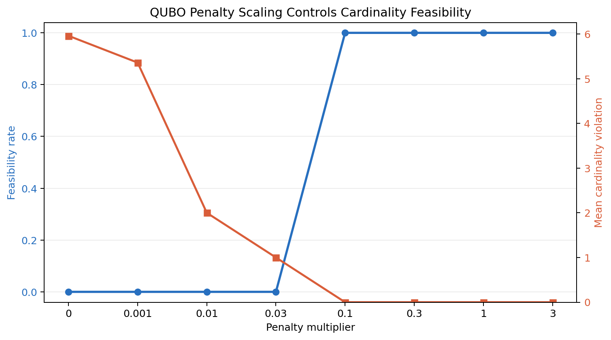

### 6.2 Phase 2: Latest-Date ETF Selection

The latest-date snapshot connects real ETF forecasts and covariance estimates to the QUBO optimizer.

For the historical-mean snapshot, with `K = 5`, portfolio-level `q = 10`, and binary-selection `q = 2`, the exact/local/greedy solution selects:

`IWM, EEM, DBC, USO, XLK`.

Top-K forecast ranking selects:

`EEM, SLV, DBC, USO, XLK`.

Top-K has a worse risk-adjusted objective gap of `0.00068839`.

For the LASSO snapshot, exact/local selection chooses:

`IEF, SHY, LQD, HYG, DBC`.

Top-K LASSO ranking chooses:

`EEM, SLV, USO, XLV, XLY`.

Top-K has a worse objective gap of `0.00441858`.

These snapshots support the idea that simple top-K ranking can be quite different from a covariance-aware sparse optimizer.

### 6.3 Phase 3: Monthly Walk-Forward Backtests

The main backtests use monthly rebalancing. At each rebalance date:

1. estimate `mu` using only past data,
2. estimate `Sigma` from trailing returns using Ledoit-Wolf shrinkage,
3. solve the sparse selection problem,
4. hold an equal-weight portfolio of selected assets until the next rebalance,
5. record realized daily returns, turnover, feasibility, objective gaps, and performance metrics.

Performance metrics include:

- annual return, computed as compound annual growth rate,
- annualized mean return,
- annualized volatility,
- Sharpe ratio, computed as annualized mean return divided by annualized volatility,
- max drawdown,
- cumulative return,
- mean turnover,
- objective gap versus exact enumeration when exact is enabled.

### 6.4 q/K Regime Analysis

The historical-mean backtest is repeated over multiple cardinalities and portfolio-level risk-aversion values. This tests whether the optimizer helps only in a narrow setting or whether there are identifiable regimes where risk-aware sparse selection improves on simple top-K ranking.

### 6.5 Phase 5: Solver Scaling

Synthetic instances with increasing asset counts are used to benchmark solver runtime and objective gaps. Exact constrained enumeration provides the gap oracle, while exact full-QUBO enumeration is shown only while it remains computationally reasonable. This experiment supports the computer science part of the project by separating solver behavior from financial forecast noise.

## 7. Results

### 7.1 Historical-Mean Backtest

Setup:

- ETF universe: 20 ETFs,
- monthly rebalances from 2018 onward,
- forecast: trailing 252-day historical mean,
- covariance: Ledoit-Wolf,
- `K = 5`,
- portfolio-level `q = 10`,
- binary-selection `q = 2`,
- penalty multiplier: `0.1`,
- solvers: exact, top-K, local search, `neal`.

| Strategy | Annual Return | Annual Volatility | Sharpe | Max Drawdown | Mean Turnover | Mean Objective Gap |
| --- | ---: | ---: | ---: | ---: | ---: | ---: |
| exact | 0.1082 | 0.1233 | 0.8954 | -0.1719 | 0.2020 | 0.000000 |
| local_search | 0.1063 | 0.1229 | 0.8842 | -0.1719 | 0.2061 | 0.000001 |
| top_k_mu | 0.1501 | 0.1820 | 0.8601 | -0.2538 | 0.2102 | 0.002604 |
| neal | 0.1063 | 0.1304 | 0.8406 | -0.2196 | 0.6388 | 0.001453 |

Figure:

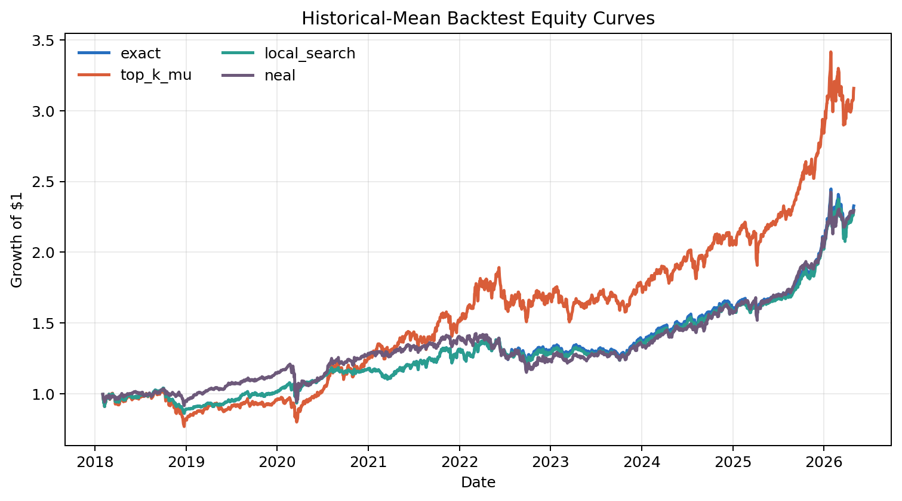

The historical-mean backtest shows the main case where QUBO-style risk-aware selection helps. Top-K by forecast earns higher raw return, but it has much higher volatility and deeper drawdown. Exact and local-search portfolios have lower annual return but better Sharpe and a smoother equity curve. Local search closely tracks exact enumeration, suggesting that a simple classical heuristic is a strong practical baseline.

The `neal` sampler remains feasible but is noisier, with higher turnover and lower Sharpe than exact/local search in this configuration.

Figure:

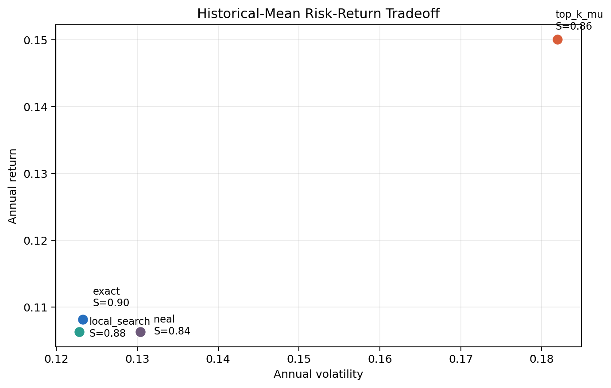

The risk-return scatter makes the tradeoff clear: top-K sits at the high-return, high-volatility corner, while exact/local search move left toward lower volatility and slightly better Sharpe.

### 7.2 LASSO Forecast Backtest

Setup:

- ETF universe: 20 ETFs,
- monthly rebalances from 2020 onward,
- forecast: LASSO on lagged returns and rolling volatility,
- target: 5-day forward return,
- covariance: Ledoit-Wolf,
- `K = 5`,
- portfolio-level `q = 10`,
- binary-selection `q = 2`,
- solvers: exact, top-K, local search.

| Strategy | Annual Return | Annual Volatility | Sharpe | Max Drawdown | Mean Turnover | Mean Objective Gap |
| --- | ---: | ---: | ---: | ---: | ---: | ---: |
| top_k_mu | 0.2294 | 0.2002 | 1.1320 | -0.2050 | 0.5459 | 0.007102 |
| exact | 0.0769 | 0.1008 | 0.7855 | -0.1604 | 0.2892 | 0.000000 |
| local_search | 0.0726 | 0.1011 | 0.7439 | -0.1604 | 0.2892 | 0.000001 |

Figure:

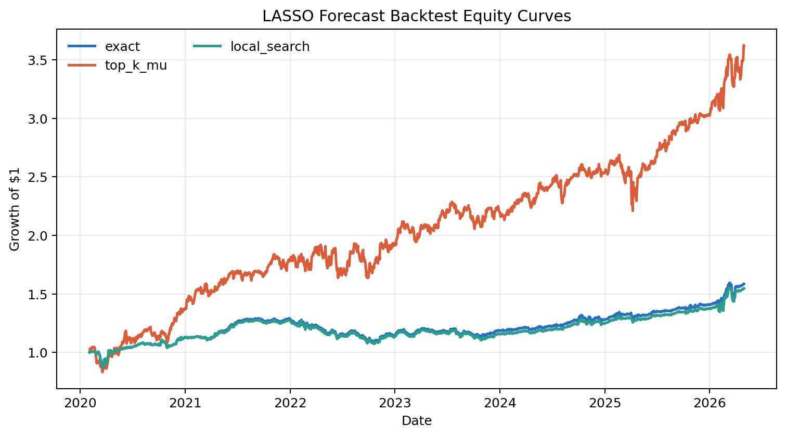

This is the strongest counterexample to an overconfident "QUBO wins" story. In the LASSO backtest, top-K ranking has much higher realized annual return and higher Sharpe, even though it is worse under the in-sample risk-adjusted objective. Exact and local-search portfolios do what they are asked to do: they reduce covariance exposure and hold lower-volatility baskets. But in this realized sample, that conservatism gives up too much return.

Figure:

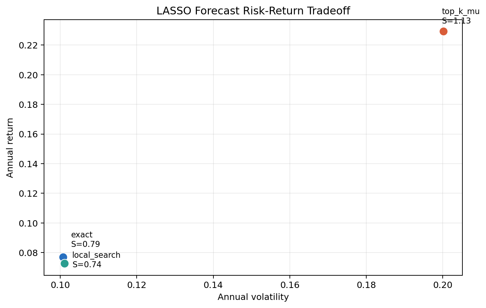

This result is useful rather than embarrassing. It shows that the optimizer is not a magic performance layer. It is a modeling layer. If the objective function or risk-aversion setting is too conservative relative to the forecast signal, top-K ranking can dominate out of sample.

### 7.3 Gradient Boosting Robustness Backtest

The gradient boosting run uses the same 20-ETF universe, monthly rebalancing from 2020 onward, 5-day forward-return target, Ledoit-Wolf covariance, `K = 5`, and portfolio-level `q = 10`.

| Strategy | Annual Return | Annual Volatility | Sharpe | Max Drawdown | Mean Turnover | Mean Objective Gap |
| --- | ---: | ---: | ---: | ---: | ---: | ---: |
| top_k_mu | 0.2004 | 0.1889 | 1.0619 | -0.3103 | 0.6757 | 0.001212 |
| exact | 0.1551 | 0.1750 | 0.9116 | -0.3070 | 0.6730 | 0.000000 |
| local_search | 0.1551 | 0.1750 | 0.9116 | -0.3070 | 0.6730 | 0.000000 |

Figures:

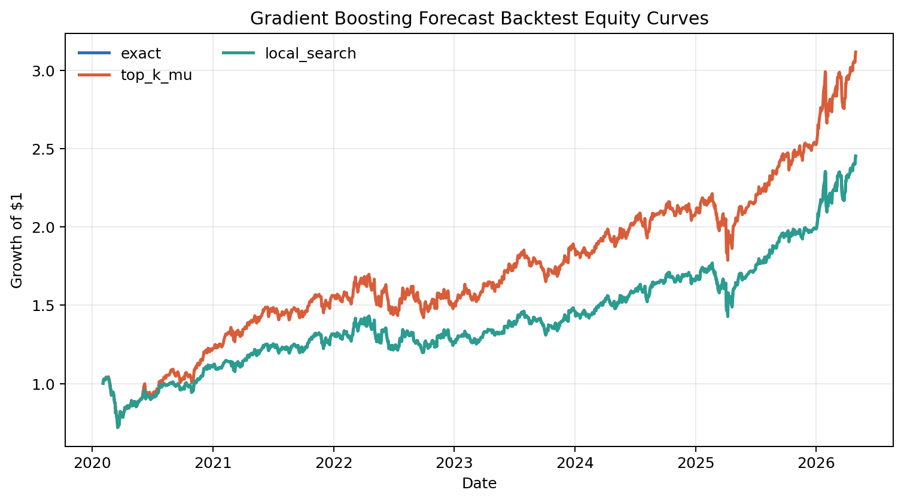

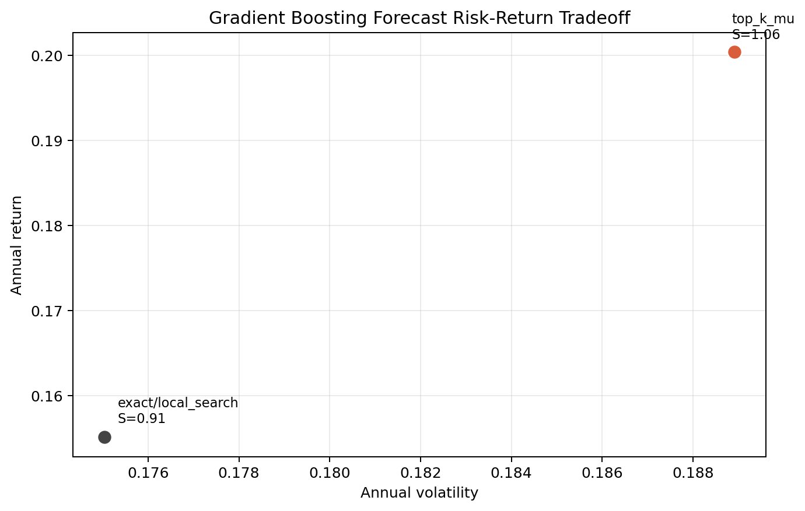

This robustness check sits between the historical-mean result and the LASSO counterexample. Top-K still wins realized Sharpe, but exact/local QUBO portfolios are much closer than they were in the LASSO run. Exact and local search are identical here, which further supports local search as a strong practical optimizer. The result strengthens the main conclusion: QUBO controls a specified risk-return objective, but realized performance depends on how the forecast model distributes return signals across assets.

### 7.4 q/K Regime Sweep

A historical-mean q/K sweep compares top-K ranking with local search for:

- `K in {3, 5, 8}`,
- portfolio-level `q in {1, 3, 10, 30}`.

Figure:

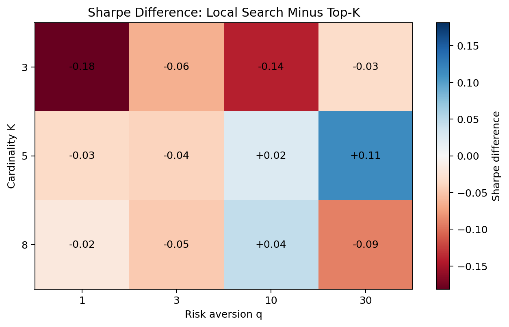

Key patterns:

- For `K = 3`, top-K wins Sharpe for all tested risk-aversion values.
- For `K = 5`, local search wins Sharpe at `q = 10` and `q = 30`.
- For `K = 8`, local search wins at `q = 10`.
- The optimizer helps most when the portfolio has enough assets for diversification and the risk-aversion parameter is strong enough to matter.
- Very high risk aversion can help a moderate-cardinality defensive basket, but can become too conservative in other regimes.

Selected rows:

| K | q | Strategy | Annual Return | Annual Volatility | Sharpe | Max Drawdown |
| ---: | ---: | --- | ---: | ---: | ---: | ---: |
| 3 | 1 | top_k_mu | 0.1968 | 0.2257 | 0.9100 | -0.2935 |
| 3 | 30 | local_search | 0.0681 | 0.0788 | 0.8761 | -0.1498 |
| 5 | 10 | local_search | 0.1063 | 0.1229 | 0.8842 | -0.1719 |
| 5 | 10 | top_k_mu | 0.1501 | 0.1820 | 0.8601 | -0.2538 |
| 5 | 30 | local_search | 0.0782 | 0.0806 | 0.9742 | -0.1273 |
| 8 | 10 | local_search | 0.1017 | 0.1141 | 0.9065 | -0.1470 |
| 8 | 10 | top_k_mu | 0.1340 | 0.1609 | 0.8622 | -0.2506 |

This regime dependence is the central empirical message. QUBO sparse optimization is not universally superior, but it is useful in identifiable settings.

### 7.5 Selection Frequency

Figure:

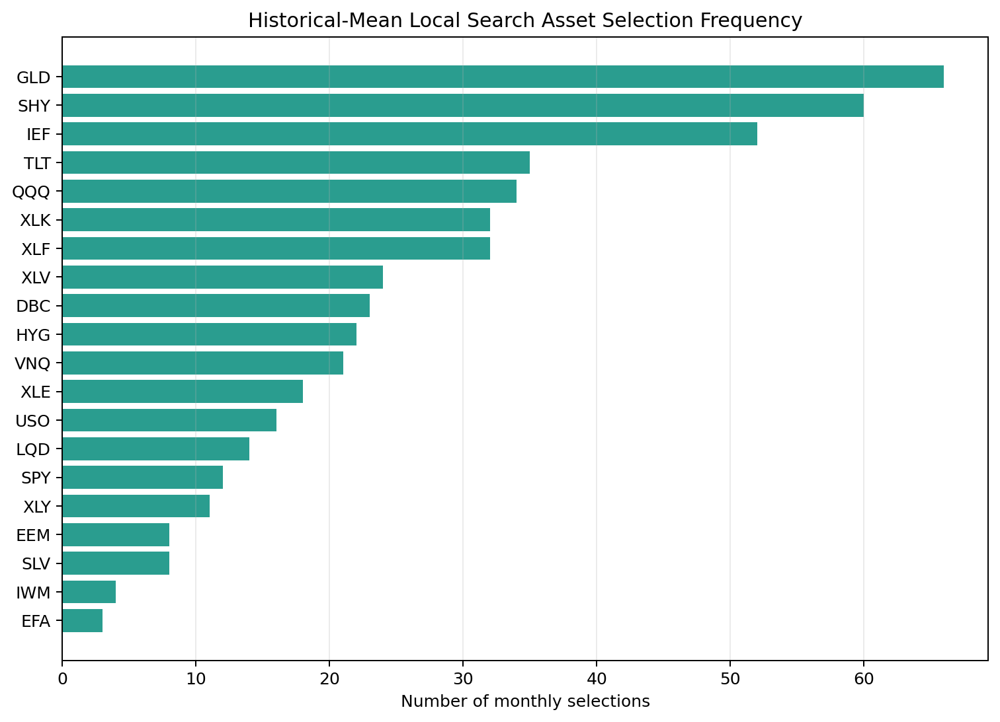

The local-search optimizer frequently selects defensive or diversifying ETFs such as `SHY`, `IEF`, `HYG`, `GLD`, and `LQD`. This helps explain its lower volatility and drawdown. The optimizer is not simply selecting the highest forecast-return assets; it is selecting baskets that trade return against covariance.

### 7.6 Solver Scaling

The final experiment benchmarks solver runtime and objective gaps on synthetic QUBO instances with increasing asset counts:

- `n in {8, 10, 12, 14, 16, 18, 20}`,
- `K = 5`,
- three random seeds per `n`,
- exact constrained enumeration as the objective-gap oracle,
- exact full-QUBO enumeration only through `n = 16`,
- top-K, greedy, local search, in-house simulated annealing, and `neal`.

Figures:

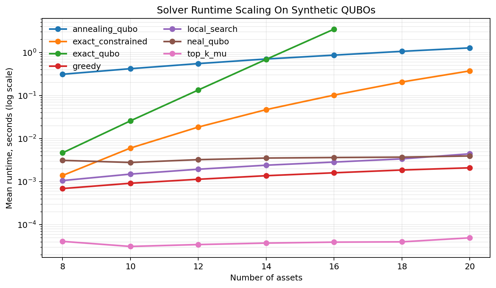

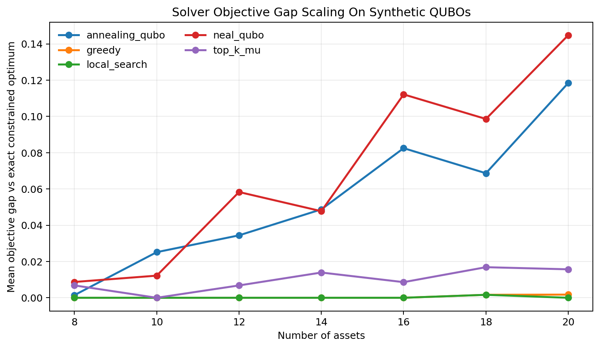

The runtime plot shows the expected scaling pattern. Top-K is essentially instantaneous because it only sorts forecasts. Greedy and local search remain very fast. Exact constrained enumeration grows with the number of `K`-combinations, while exact full-QUBO enumeration grows much more quickly because it must enumerate all `2^n` binary vectors. In the experiment, exact full-QUBO enumeration is already around `3.48` seconds by `n = 16`, so it is not run for `n = 18` or `n = 20`.

The objective-gap plot reinforces the practical role of local search. In this synthetic benchmark, local search is near-exact and has zero mean gap at most tested sizes. Greedy is also strong but has small gaps at larger `n`. The generic annealing baselines remain feasible but produce larger objective gaps under the simple default settings used here.

This strengthens the computer science story: exact solvers are useful for validation, while local search is the most competitive practical baseline in the current implementation. Annealing-style methods are interesting and QUBO-compatible, but they require tuning before they can be claimed as strong optimizers.

## 8. Discussion

The results support a nuanced conclusion.

First, QUBO formulation is useful because it makes the sparse portfolio problem precise. The cardinality constraint can be encoded directly, the QUBO expansion can be tested exactly, and penalty calibration can be studied rather than hand-waved.

Second, simple classical baselines are strong. Local search often matches exact enumeration in the tested ETF setting. This matters because a quantum-inspired project should not compare annealing only against weak baselines. In this project, the practical benchmark is local search, not just exact enumeration or top-K ranking.

Third, solver quality and financial performance are different things. A solver can minimize the in-sample risk-adjusted objective and still underperform out of sample if expected return forecasts are noisy or the risk-aversion parameter is misspecified. This is visible in the LASSO experiment, where top-K ranking wins realized Sharpe despite having a worse objective gap.

Fourth, the annealing-style solver is feasible but not dominant. `neal` produces feasible QUBO samples, but in the historical backtest it has higher turnover and lower Sharpe than exact/local search. This suggests that future work should include turnover penalties or better annealing tuning before presenting annealing as a competitive practical solver.

Finally, the q/K sweep shows that the optimizer's value is regime-dependent. QUBO helps when `K` is large enough to permit diversification and when risk aversion is strong enough to affect selection. For very small sparse portfolios, top-K ranking can be difficult to beat.

The quantum-computing interpretation should be just as careful. Quantum methods are potentially better suited to this family of problems because the mathematical object is already an energy minimization problem over binary variables. Quantum annealers are built around energy landscapes, and gate-model variational methods also reduce many optimization tasks to repeated preparation and measurement of low-energy states. In principle, this may be helpful when the feasible set is huge, constraints are numerous, and the user values high-quality candidate portfolios rather than a single closed-form estimator.

However, this project does not show quantum advantage. It shows the groundwork that would make a future quantum comparison meaningful: a correct QUBO, calibrated penalties, leakage-aware ML forecasts, exact small-instance validation, strong classical baselines, and runtime/gap measurements. Without those pieces, a "quantum finance" project becomes just a branding exercise. With them, the project becomes a serious computational economics experiment.

For ECON students, the broader discovery is that modern ML does not end at prediction. A return forecast has no economic value until it is connected to a decision rule. Econometrics and ML help estimate the uncertain objects; optimization converts them into actions; quantum computing, if it becomes practically relevant, may expand the scale or constraint complexity of the decisions we can search over. Learning the QUBO formulation today is therefore like learning a portable interface between statistical models and future computational hardware.

## 9. Limitations

This project has several limitations.

1. The asset universe is limited to 20 ETFs. This is enough for a class project and exact validation, but it is not a broad production portfolio.
2. The ML forecast model is intentionally simple. LASSO uses lagged returns and volatility features, but richer predictors could change the results.
3. The current portfolio is equal-weighted after selection. A two-stage method could use QUBO for selection and then solve a continuous convex optimization problem for weights.
4. Transaction costs are not modeled directly. Turnover is measured, but no trading-cost penalty is included in the main backtests.
5. `neal` is a simulated annealing baseline, not evidence of quantum advantage.
6. Results are educational and empirical; they should not be interpreted as investment advice.
7. The current quantum discussion is prospective. The project studies quantum-compatible formulations and annealing-style baselines, not production quantum hardware.

## 10. Future Work

The most useful extensions are:

1. Extend solver scaling to larger `K` or more random seeds if the presentation needs a deeper solver benchmark.
2. Add a QUBO-compatible turnover penalty, `C sum_i (x_i - x_prev_i)^2`, which expands into the diagonal adjustment `Q_ii <- Q_ii + C(1 - 2 x_prev_i)`.

3. Test a two-stage hybrid method: QUBO selects the sparse set, then a continuous optimizer assigns weights.
4. Explore an index-tracking variant where the goal is to approximate a benchmark with a sparse subset.
5. Add a "future quantum relevance" experiment by comparing the same QUBO instance across local search, `neal`, OpenJij simulated quantum annealing, and, if access is available, a cloud hybrid quantum optimizer. The key output should be objective gap, feasibility, runtime, and sensitivity to penalty scaling, not a vague claim of quantum superiority.

## 11. Conclusion

This project demonstrates a complete CS-oriented financial ML pipeline for sparse portfolio optimization. Course-covered forecasting methods provide return signals, covariance estimation provides a risk model, and QUBO converts sparse portfolio selection into a binary quadratic objective. The implementation validates the QUBO math, benchmarks exact and heuristic solvers, and evaluates strategies with walk-forward backtests.

The empirical result is intentionally nuanced. QUBO/local-search optimization can improve risk-adjusted performance and reduce drawdowns in historical-mean regimes, especially when cardinality and risk aversion are favorable. But it does not universally beat top-K ranking. In the LASSO forecast backtest, top-K achieves higher realized Sharpe, while QUBO selection remains more conservative.

The strongest final takeaway is:

> QUBO sparse portfolio optimization is best understood as a controllable decision layer for financial ML forecasts. Its value depends on objective design, penalty scaling, solver behavior, and validation quality.

That conclusion is more credible than a simple "quantum-inspired optimization wins" claim, and it gives the project a defensible computer science identity inside a financial machine learning course. It also gives the project a forward-looking meaning: if quantum optimization becomes practically relevant, economists and ML researchers will still need to formulate the economic problem correctly, estimate the inputs responsibly, and benchmark the solver honestly. The quantum computer would not replace econometrics; it would make the decision layer more computationally ambitious.

## References

- Markowitz, H. (1952). Portfolio Selection. The Journal of Finance.
- Lucas, A. (2014). Ising formulations of many NP problems. Frontiers in Physics.
- Qiskit Finance. (2026). Portfolio Optimization tutorial.
- Sakuler, W., Oberreuter, J. M., Aiolfi, R., Asproni, L., Roman, B., and Schiefer, J. (2025). A real-world test of portfolio optimization with quantum annealing. Quantum Machine Intelligence.
- Lu, Y.-C., Fu, C.-M., Yu, L.-P., Chang, Y.-J., and Chang, C.-R. (2024). Quantum-Inspired Portfolio Optimization In The QUBO Framework.
- Palmer, S., Sahin, S., Hernandez, R., Mugel, S., and Orus, R. (2021). Quantum Portfolio Optimization with Investment Bands and Target Volatility.
- Palmer, S., Karagiannis, K., Florence, A., Rodriguez, A., Orus, R., Naik, H., and Mugel, S. (2022). Financial Index Tracking via Quantum Computing with Cardinality Constraints.
- Buonaiuto, G., Gargiulo, F., De Pietro, G., Esposito, M., and Pota, M. (2023). Best practices for portfolio optimization by quantum computing, experimented on real quantum devices. Scientific Reports.
- Egger, D. J., Gambella, C., Marecek, J., McFaddin, S., Mevissen, M., Raymond, R., Simonetto, A., Woerner, S., and Yndurain, E. (2020). Quantum Computing for Finance: State-of-the-Art and Future Prospects. IEEE Transactions on Quantum Engineering.
- IBM Quantum Documentation. (2026). Quantum Portfolio Optimizer: A Qiskit Function by Global Data Quantum.
- D-Wave Ocean Documentation. (2026). Binary Quadratic Model documentation.
- D-Wave neal Documentation. (2026). Simulated Annealing Sampler.
- Ledoit, O., and Wolf, M. (2004). A Well-Conditioned Estimator for Large-Dimensional Covariance Matrices. Journal of Multivariate Analysis.
- yfinance package documentation. (2026).

## Reproducibility Commands

All commands should be run from:

`final/quantum_inspired_sparse_portfolio_optimization`

Use `uv` for all Python work:

```bash
uv --cache-dir .uv-cache run pytest
uv --cache-dir .uv-cache run python scripts/phase1_random_sweep.py
uv --cache-dir .uv-cache run python scripts/phase2_baseline_selection.py
uv --cache-dir .uv-cache run python scripts/phase2_ml_selection.py
uv --cache-dir .uv-cache run python scripts/phase3_backtest_historical.py
uv --cache-dir .uv-cache run python scripts/phase3_backtest_lasso.py
uv --cache-dir .uv-cache run python scripts/phase3_sweep_historical.py
uv --cache-dir .uv-cache run python scripts/phase4_make_figures.py
```
